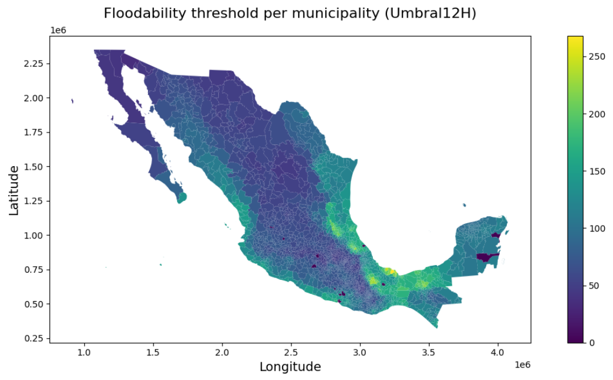
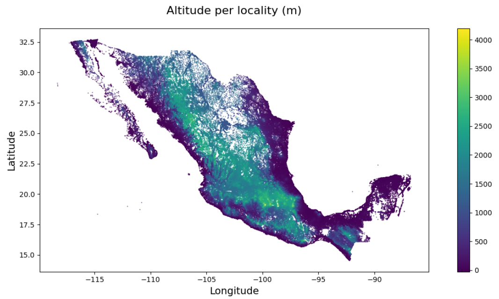
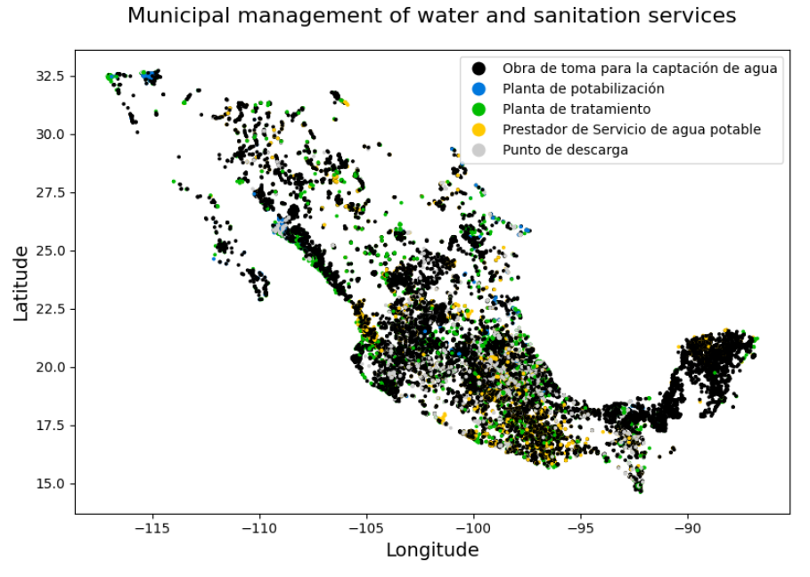
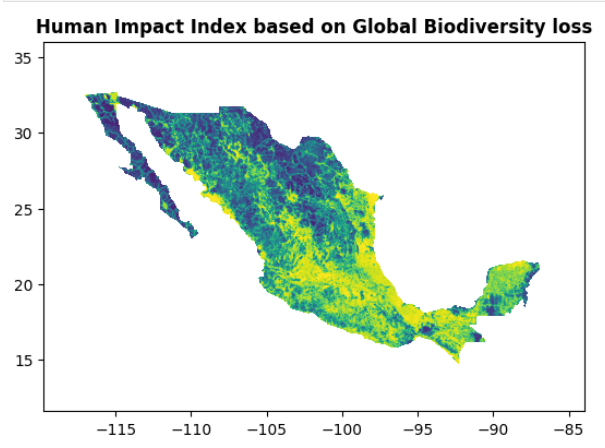
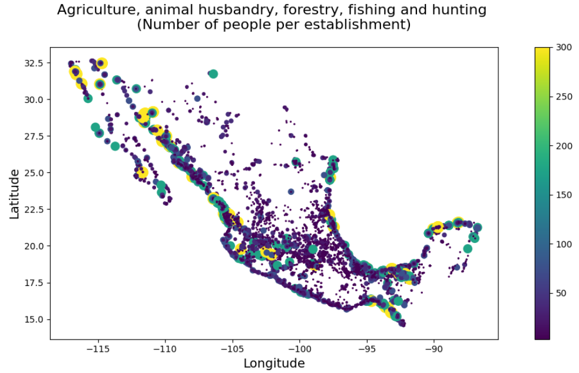
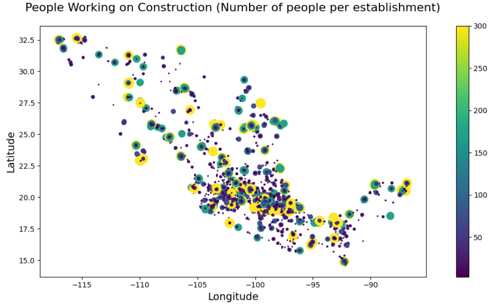

# Semi-Supervised Ensemble Learning Model for Water Quality Prediction
**Authors**: Raquel Cossío-Ramírez, Hortencia A. Ramírez-Vázquez, Amanda M. Valdez-Calderón

Mexico faces significant challenges in water contamination due to various factors, including natural contaminants, industrial pollution, agricultural runoff, urbanization, and overexploitation. As a result, 57% of the population lacks access to safe water.

This study’s objective is to create a semi-supervised ensemble model capable of predicting water quality by municipality based on environmental factors, such as population, inundability and industrial activity.

## Overview

The project focuses on extending water quality classification coverage across Mexico by combining a small set of labeled data with a large amount of unlabeled data. A self-training method using ensemble classifiers (e.g., Random Forest) is implemented to label previously unclassified municipalities.

## Methodology

1. **Data Preprocessing**
   Data is cleaned and prepared in `Data cleaning1.ipynb`.

2. **Model Training**
   Semi-supervised learning is implemented in `self_learning.ipynb` using a self-learning wrapper with ensemble classifiers.

3. **Evaluation & Visualization**
   Model performance is assessed using confusion matrices, feature importance, and label maps.

## Data

In order to predict water quality for municipalities that were not covered by measuring stations, we opt to build a dataset with features that could be indirectly related to water quality. We included features per municipality such as population, altitude, area, flood-ability threshold, number of water treatment facilities and wastewater discharge points, and number of people working in industries. In this notebook AllData.csv is the integration of the datasets metioned above.

- **File**: `AllData.csv`
- **Level**: Municipality-level indicators across Mexico
- **Includes**: Both labeled (classified) and unlabeled samples

**Input dataset: Flood-ability threshold according to precipitation and land permeability**

**Input dataset: Altitude per locality**

**Input dataset: Geospatial information on municipal management of water and sanitation services**

**Input dataset: Human Impact Index on Terrestrial Biodiversity**

**Input dataset: Economic activity. Agriculture, animal husbandry and farming, forestry, fishing, and hunting**

**Input dataset: Economic activity. Construction**

